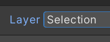
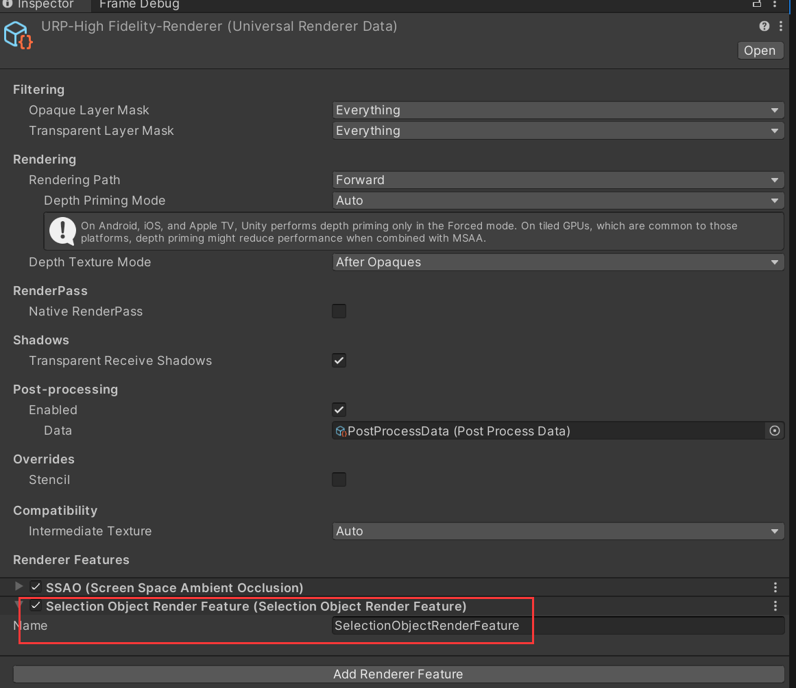
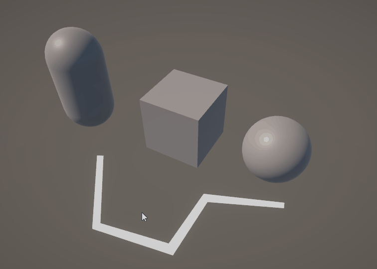

# Unity-ZPlugin-SelectionObject

 - 基于 RenderTexture 的 3D 物体选择
 - 没有 Collider 的物体也可以判断是否点击到
 - 提供给大家学习
 - 直接使用也可以, 将 Assets/Plugions/SelectionObject 这个文件夹拷贝到自己项目即可
 - 小项目不用考虑性能就尽情使用吧

## 使用方式

1. 将物体 layer 设置为 Selection



2. 往 Universal Renderer Data 里添加 SelectionObjectRenderFeature



3. 通过 SelectionObject.InstanceID 获取当前鼠标上的 GameObject ID

## Demo

换色 Demo

```

public class TestSelectionObject : MonoBehaviour {
    public Material selectedMaterial;

    private List<Material> sharedMaterials = new List<Material>();

    void Update() {
        var renderers = GameObject.FindObjectsOfType<Renderer>();
        foreach (var renderer in renderers) {
            if ((renderer.gameObject.layer & LayerMask.NameToLayer("Selection")) > 0) {
                renderer.GetSharedMaterials(sharedMaterials);
                if (renderer.gameObject.GetInstanceID() == SelectionObject.InstanceID) {
                    if (!sharedMaterials.Contains(selectedMaterial)) {
                        sharedMaterials.Add(selectedMaterial);
                        renderer.sharedMaterials = sharedMaterials.ToArray();
                    }
                }
                else {
                    if (sharedMaterials.Contains(selectedMaterial)) {
                        sharedMaterials.Remove(selectedMaterial);
                        renderer.sharedMaterials = sharedMaterials.ToArray();
                    }
                }
            }
        }
    }
}

```



## Reference

- [【UnityShader】3D拾取（PickBuffer）（19）](https://zhuanlan.zhihu.com/p/689092580)